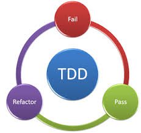

## Test Driven Learning

Adil Khan

Software Developer

Pomiet
|--|

We use TDD, right?



<cite style="font-size: 20%">https://www.perforce.com/sites/default/files/images/tdd.png</cite>

|--|
Why?
- Only seconds away from working code <!-- .element: class="fragment" data-fragment-index="1" -->
- Accurate documentation <!-- .element: class="fragment" data-fragment-index="2" -->
- Emergent Design <!-- .element: class="fragment" data-fragment-index="3" -->
- Reduce dependency on debugging <!-- .element: class="fragment" data-fragment-index="4" -->

|--|
Some impediments to TDD
- Its a 'Discipline' and takes some conscious effort.<!-- .element: class="fragment" data-fragment-index="0" -->
- Not really taught in school.<!-- .element: class="fragment" data-fragment-index="1" -->
- Difficult to start with on existing projects.<!-- .element: class="fragment" data-fragment-index="2" -->
  - Jr devs start on existing projects (paradox 1)<!-- .element: class="fragment" data-fragment-index="3" -->
  - Benefits of TDD accelerate with time. (paradox 2)<!-- .element: class="fragment" data-fragment-index="4" -->


|--|
Are we learing TDL or TDD?

<!-- .element: class="fragment" data-fragment-index="1" -->
- If you are already doing TDD.<!-- .element: class="fragment" data-fragment-index="2" -->
- Establish patterns of learning <!-- .element: class="fragment" data-fragment-index="3" -->

|--|
```
(should= 2 (+ 2 2))
(if (this)
else(that))
```
