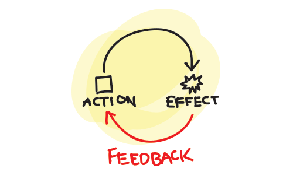
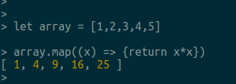

## Test Driven Learning

Adil Khan

Software Developer

Pomiet
|--|

## We use TDD, right?


<cite style="font-size: 20%">https://www.perforce.com/sites/default/files/images/tdd.png</cite>

|--|
## Why?
- Only seconds away from working code <!-- .element: class="fragment" data-fragment-index="1" -->
- Accurate documentation <!-- .element: class="fragment" data-fragment-index="2" -->
- Emergent Design <!-- .element: class="fragment" data-fragment-index="3" -->
- Reduce dependency on debugging <!-- .element: class="fragment" data-fragment-index="4" -->


> Tests are the Programmer's Stone, trasmuting fear into boredom

<cite style="font-size: 40%"> *Kent Beck (Test Driven Development by Example)* </cite>


## Feedback Loops


<cite style="font-size: 20%">https://www.smashingmagazine.com/2013/02/designing-great-feedback-loops/</cite>
|--|
## Some Impediments to TDD
- Its a 'Discipline' and takes some conscious effort.<!-- .element: class="fragment" data-fragment-index="0" -->
- Not really taught in school.<!-- .element: class="fragment" data-fragment-index="1" -->
- Difficult to start with on existing projects.<!-- .element: class="fragment" data-fragment-index="2" -->
  - Jr devs start on existing projects (paradox 1)<!-- .element: class="fragment" data-fragment-index="3" -->
  - Benefits of TDD accelerate with time. (paradox 2)<!-- .element: class="fragment" data-fragment-index="4" -->

|--|
## Are we learing TDL or TDD?

<!-- .element: class="fragment" data-fragment-index="1" -->

|--|
## BOTH!
- If you are already doing TDD.<!-- .element: class="fragment" data-fragment-index="1" -->
  - Apply what you know to learn a new language.<!-- .element: class="fragment" data-fragment-index="2" -->
- If you are new to TDD.<!-- .element: class="fragment" data-fragment-index="3" -->
  - A sandbox to learn TDD on a language you are familiar with.<!-- .element: class="fragment" data-fragment-index="4" -->

|--|
## Advantages
- Forces the exercising of Retrieval. <!-- .element: class="fragment" data-fragment-index="1" -->
- Cramming vs Spacing, 2-2-2-6 Schedule.<!-- .element: class="fragment" data-fragment-index="2" -->
- Write tests on language features. Comeback to them at a later time to reinforce.<!-- .element: class="fragment" data-fragment-index="3" -->
- Develop patterns of learning over time.<!-- .element: class="fragment" data-fragment-index="4" -->


- Benefits of TDD become apparent after you do it and you have a suite of tests.
- Benefits of TDL become apparent after you do it and you have a suite of tests.
- Manage Change.

|--|
## TDL Approach

<!-- .element: class="fragment" data-fragment-index="1" -->

```javascript

test('I can use a map to square elements in an array', ()=>{
  //Arrange
  let array = [1,2,3,4,5];

  //Act
  squaredArray = array.map((x) => {return x*x})

  //Assert
  expect(squaredArray).toEqual([1,4,9,16,25]);
});

```
<!-- .element: class="fragment" data-fragment-index="2" -->


## Larger Concepts

```javascript
describe('destructuring', () => {
  test('assign multiple vars from an array', () =>{
    let [x, y] = [1,2];
    expect(x).toBe(1);
    expect(y).toBe(2);
  });

  test('Using Rest Pattern, if fewer vars than elements, last var gets rest', () =>{
    let [x, ...y] = [1,2,3,4];
    expect(x).toBe(1);
    expect(y).toEqual([2,3,4]);
  });

  describe('Object destructuring', () => {
    test('Objects can be destructured too', () =>{
      let {name, city} = {name: 'homer', city: 'springfield'}

      expect(name).toBe('homer');
      expect(city).toBe('springfield');
    });

    test('But not if they dont match the variable name', () =>{
      let {x, y} = {name: 'homer', city: 'springfield'}
      expect(x).toBe(undefined);
      expect(y).toBe(undefined);
    })

    test('However we can explicitly give it a new variable name', ()=>{
      let {name: x, city: y} = {name: 'homer', city: 'springfield'}
      expect(x).toBe('homer');
      expect(y).toBe('springfield');
    });
  });
});
``` 
<!-- .element: style="font-size: 23%" -->

|--|
## Other approaches
1. Koans
2. Katas
3. See what works for you.

|--|
# ? <!-- .element: style="font-size: 1500%" -->
|--|
## Exercises

```
git clone https://github.com/AdilKhn/tdl-exercise

```

```
git checkout ex1
```

```bash
cd app
../lein spec -f d
```
