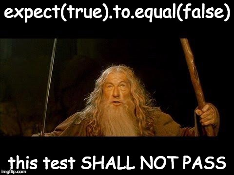
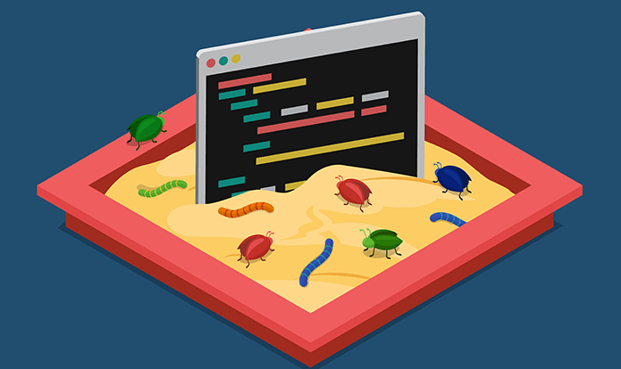

### Test Driven Learning

Adil Khan

Software Developer

Note: 
- Intro
- Background
- What the talk is about
|--|
### Overview
- TDD
- TDL
- Examples
- Exercises

|--|

### We use TDD, right?

<!-- .element: class="stretch" -->

|--|
### Why?
- Only seconds away from working code <!-- .element: class="fragment" data-fragment-index="1" -->
- Accurate documentation <!-- .element: class="fragment" data-fragment-index="2" -->
- Emergent Design <!-- .element: class="fragment" data-fragment-index="3" -->
- Reduce dependency on debugging <!-- .element: class="fragment" data-fragment-index="4" -->

Note: Kotlin presentation by Bob Martin (Prime factors)


> Tests are the Programmer's Stone, trasmuting fear into boredom

<cite style="font-size: 40%"> *Kent Beck (Test Driven Development by Example)* </cite>
Note: 'The more tests I run the less stress I feel'


### Feedback Loops


<cite style="font-size: 20%">https://www.smashingmagazine.com/2013/02/designing-great-feedback-loops/</cite>
|--|
### Some Impediments to TDD
- It's a 'Discipline' and takes some conscious effort.<!-- .element: class="fragment" data-fragment-index="0" -->
- Not really taught in school.<!-- .element: class="fragment" data-fragment-index="1" -->
- Difficult to start with on existing projects.<!-- .element: class="fragment" data-fragment-index="2" -->
  - Jr devs start on existing projects.<!-- .element: class="fragment" data-fragment-index="3" -->
  - Benefits of TDD accelerate with time.<!-- .element: class="fragment" data-fragment-index="4" -->
Note: Paradox of jr devs and benefits accelerate with time.
|--|
### Are we learing TDL or TDD?


|--|
### BOTH!
- If we are already comfortable with TDD:<!-- .element: class="fragment" data-fragment-index="1" -->
  - Apply what we know to learn something new.<!-- .element: class="fragment" data-fragment-index="2" -->
- If we are new to TDD: <!-- .element: class="fragment" data-fragment-index="3" -->

<!-- .element: class="fragment" width="50%" height="50%"  data-fragment-index="4" -->

<cite class="fragment" data-fragment-index="4" style="font-size: 20%">http://www.guidingtech.com/56168/protect-windows-10-pc-shade-sandbox/</cite>

Note: New language, framework, algorithm etc.
|--|
### Some Advantages
- Cramming vs Spacing.<!-- .element: class="fragment" data-fragment-index="2" -->
- Write tests on language features. Comeback to them at a later time to reinforce.<!-- .element: class="fragment" data-fragment-index="3" -->
- Develop patterns of learning over time.<!-- .element: class="fragment" data-fragment-index="4" -->
Note: 2-2-2-6 Schedule to optimize recall/Retrieval


- Benefits of TDD become apparent after you do it and you have a suite of tests.
- Benefits of TDL become apparent after you do it and you have a suite of tests.
- Manage Change. <!-- .element: class="fragment" data-fragment-index="1" -->

<!-- .element: class="fragment" width="30%" height="30%"  data-fragment-index="1" -->

<cite class="fragment" data-fragment-index="1" style="font-size: 20%">http://indosurflife.com/2013/12/why-you-cant-surf-a-tsunami/</cite>
Note: Debate on whether we can actually surf a Tsunami?
|--|
### TDL Approach

<!-- .element: class="fragment" data-fragment-index="1" -->

```javascript

test('I can use a map to square elements in an array', ()=>{
  //Arrange
  let array = [1,2,3,4,5];

  //Act
  squaredArray = array.map((x) => {return x*x})

  //Assert
  expect(squaredArray).toEqual([1,4,9,16,25]);
});

```
<!-- .element: class="fragment" data-fragment-index="2" -->


### Exploring Concepts

```javascript
describe('destructuring', () => {
  test('assign multiple vars from an array', () =>{
    let [x, y] = [1,2];
    expect(x).toBe(1);
    expect(y).toBe(2);
  });

  test('Using Rest Pattern, if fewer vars than elements, last var gets rest', () =>{
    let [x, ...y] = [1,2,3,4];
    expect(x).toBe(1);
    expect(y).toEqual([2,3,4]);
  });

  describe('Object destructuring', () => {
    test('Objects can be destructured too', () =>{
      let {name, city} = {name: 'homer', city: 'springfield'}
      expect(name).toBe('homer');
      expect(city).toBe('springfield');
    });

    test('But not if they dont match the variable name', () =>{
      let {x, y} = {name: 'homer', city: 'springfield'}
      expect(x).toBe(undefined);
      expect(y).toBe(undefined);
    })

    test('However we can explicitly give it a new variable name', ()=>{
      let {name: x, city: y} = {name: 'homer', city: 'springfield'}
      expect(x).toBe('homer');
      expect(y).toBe('springfield');
    });
  });
});
``` 
<!-- .element: style="font-size: 32%" class="stretch" -->

|--|
### Other approaches
1. Koans
2. Katas
3. Combine the best parts.

Note: Koans are written in a TDD way. Katas exist, but we can Test Drive them.
|--|
# ? <!-- .element: style="font-size: 1500%" -->
|--|
## Exercises

```
git clone https://github.com/AdilKhn/tdl-exercise

```

```
git checkout ex1
```

```bash
cd app
../lein spec -f d
```
